# Visual Studio Code配置

Copyright (C) 2022, HITCRT_VISION, all rights reserved.  
Author:BG2EDG(928330305@qq.com)  
Time:2022-06-28  

## 简介

Visual Studio Code(以下简称vscode)是MicroSoft出品的一款开源编辑器，具有易上手、体量轻、生态强大等特点。鉴于vscode的众多优点，在竞培营阶段要求大家使用vscode进行编辑，同时也是为了统一规范格式。如果有十分喜爱CLion的同学，需要自行确保IDE配置与规范文档要求一致，且在使用过程中自行解决CLion相关的使用问题。对于vscode的使用，第一周要做到了解页面上常用功能在哪个位置，并把插件和设置改好，熟练度可以在使用过程中提升。  

## 页面分区  

vscode中有很多不起眼的小标志都可以点击，下图用框出来了几处可以点按或包含信息的位置。  
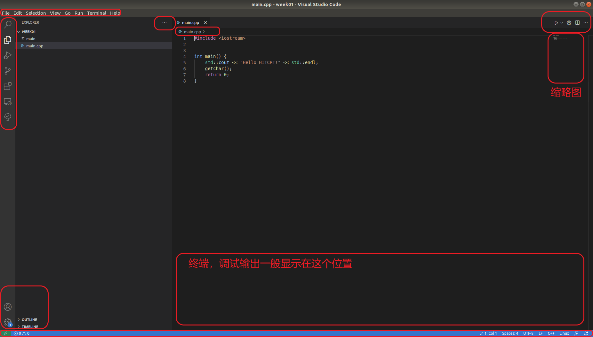

## 插件安装  

作为一个编辑器，vscode功能终究是有限的，无法像CLion等IDE一样可以开箱即用，需要通过各种插件来实现编辑器以外的功能。使用```Ctrl+Shift+X```打开插件栏，在其中搜索以下几个插件并点击install安装。  

### 必装　　

**C/C++ Extension Pack**：6个重要的C++开发插件  
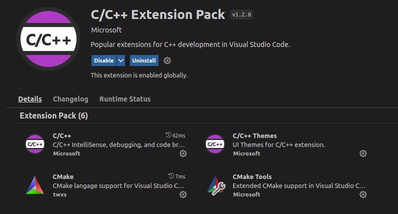  
**Code Runner**:可以实现一键运行代码，初步学习/复习C++语法的前三周会用这个，直到讲完CMake。  
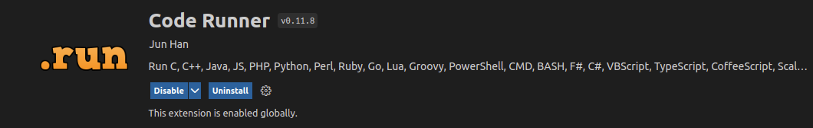  
**cmake-format**:CMakeList自动格式化，风格统一，防止误修改  
  
**Markdown All in One**:Markdown编辑，语法高亮，预览  
  
**Markdonwlint**:Markdown语法纠正  

**Todo Tree**:将代码中的TODO高亮显示，提示未完成的部分  
  
**Path Autocomplete**:文件路径自动补全  
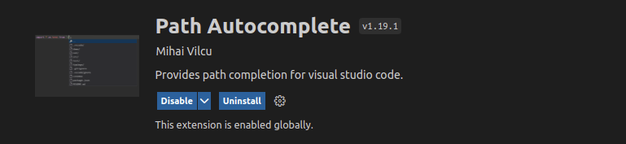  
**Include Autocomplete**:头文件路径/名称自动补全  
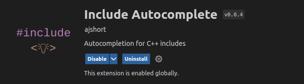  
**Git History Diff**:查看代码的git历史信息，光标放在代码上就能显示出　　
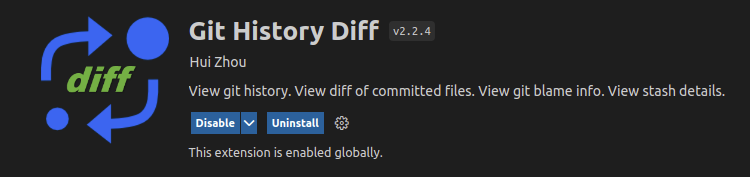  

### 选装

**C++ Helper**:自动生成函数实现对应的代码块  
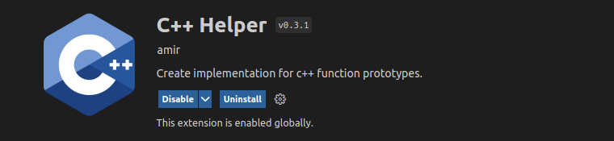  
**Cpp Reference**:查看www.cppreference.com上的函数说明  
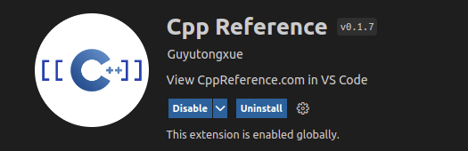  
**Git History**：查看git历史，指令需要自行配置快捷键  
  

## settings

vscode虽然只是一个编辑器，但是其丰富的插件可以将其打造为一个IDE。而这些插件实际功能的配置，往往是通过修改settings来定制的。settings有三个，分别是默认设置、用户全局设置和当前工作空间设置。默认设置对应defaultSettings.json，是插件的默认设置，不建议对此进行修改，以防错误修改后无法回退。用户全局设置对应settings.json，这个文件中的设置会用于全局，并将默认设置覆盖掉。当前空间设置只决定当前工作空间(workspace)下的设置，设置内其settings.json在打开vscode目录下的.vscode文件夹里。配置settings有两种方式，一种是点击左上角File->Preferences->Settings，然后在搜索框中找要修改的内容修改，此处的修改会添加到用户全局设置settings.json文件中。另一种是直接修改settings.json中对应项目的内容。user的settings通过```Ctrl+Shift+P```，输入```settings.json```打开。为了保持一致，通常不在workspace中单独加settings，只对user的进行修改。修改时要注意json文件的格式，如果报错可能是少逗号(comma)、引号或大括号不对称  造成。  

### 自动格

File->Preferences->Settings->搜索＂clang-format＂，出现如下搜索结果  
  
在图中第一个和第三个结果处粘贴如下内容  

```json
{ "BasedOnStyle": "Google",  "IndentWidth": 4,  "TabWidth": 4,  "ColumnLimit": 110}
```

clang-format是一个自动格式化代码的工具，能按指定规范要求自动调节空格、换行、大括号位置等。上述设置中的```ColumnLimit```项确定了一行的最大长度，可根据自己的屏幕分辨率和字号大小调整(我的屏幕比较小，字号大，110个字符一行比较合理，如果设置成0则一行长度无限制)，其他设置不要变动。  

打开settings.json，将如下内容粘贴到最后一项后

```json
    "[markdown]": {
        // "editor.defaultFormatter": "yzhang.markdown-all-in-one"
        "editor.defaultFormatter": "DavidAnson.vscode-markdownlint"
    },
```

上述内容配置了Markdown的自动格式化插件，此处使用的是markdownlint的，也可使用markdown-all-in-one的.  
最后搜索```format on save```，勾选该项  
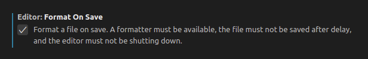  

设置完成后打开任意C++或Markdown文件，使用快捷键```Ctrl+Shift+I```完成自动格式调整。  

### Doxygen风格注释

将下面几行粘贴到settings.json中，如果原来有就把原来的删掉.  

```json

// Doxygen documentation generator set
    "doxdocgen.file.copyrightTag": [
        "@copyright Copyright (C) {year}, HITCRT_VISION, all rights reserved."
    ],
    "doxdocgen.file.customTag": [
        "@par 修改日志:",
        "<table>",
        "<tr><th>Date       <th>Author  <th>Description",
        "<tr><td>{date} <td>{author}  <td>",
        "</table>",
    ],
    "doxdocgen.file.fileOrder": [
        "file",
        "brief",
        "author",
        "date",
        "empty",
        "copyright",
        "empty",
        "custom"
    ],
    "doxdocgen.file.fileTemplate": "@file {name}",
    "doxdocgen.generic.authorEmail": "My email",
    "doxdocgen.generic.authorName": "My name",
    "doxdocgen.generic.authorTag": "@author {author} ({email})",
    "doxdocgen.generic.order": [
        "brief",
        "tparam",
        "param",
        "return",
        "author"
    ],
    "doxdocgen.generic.paramTemplate": "@param[in]{indent:8} {param}{indent:25}My Param doc",
    "doxdocgen.generic.returnTemplate": "@return {type} ",
    "doxdocgen.generic.splitCasingSmartText": true,

```

其中authorEmail和authorName要把：右侧的内容替换成自己的邮箱和名字.

```json
    "doxdocgen.generic.authorEmail": "My email",
    "doxdocgen.generic.authorName": "My name",

```

paramTemplate是按照格式生成的函数注释，在添加后要根据函数的输入修改in/out，以及更改My Param doc的内容

```json
    "doxdocgen.generic.paramTemplate": "@param[in]{indent:8} {param}{indent:25}My Param doc",
```

配置完成后，找到任意一个函数，在其定义的前一行输入```/**```，然后回车，即可自动生成注释模板。在任意文件第一行输入```/**```，然后回车，即可生成文件注释模板。  

### code runner运行指令

在其settings.json最后面一行粘贴下面这行配置  

```json
"code-runner.executorMap": {
    "cpp": "cd $dir && g++ -std=c++17 *.cpp -g -o $fileNameWithoutExt && $dir$fileNameWithoutExt",
},
"code-runner.runInTerminal": true,
```

Code Runner实际的功能就是把某些指令设置一个快捷键，code-runner.executorMap这行配置实际是一行Shell指令。更改后的效果是，将C++标准设为C++17,编译输出调试信息，并且将当前文件夹下的所有cpp都编译，这样在后面文件拆分后才不会报错。  

code-runner.runInTerminal设置为true后，可以让Code Runner的输出在一个TERMINAL窗口里，而不是在OUTPUT窗口。区别是在终端窗口里运行的程序可以用键盘交互控制，而OUTPUT中的程序则不行。  

## Hello vscode

这里介绍如何在前述配置下用vscode编写一个Hello World!程序并运行，更多使用技巧参考扩展阅读。

### 1.创建项目

首先在任意路径下右键选择在终端打开，使用命令行建立文件夹和文件。  

```bash
mkdir week01 #新建文件夹
cd week01 # 进入文件夹
touch main.cpp #新建文件
code . # 在vscode中打开文件夹
```

也可以在新建文件夹后，直接用vscode打开，然后点击左侧资源管理器，新建cpp文件。  

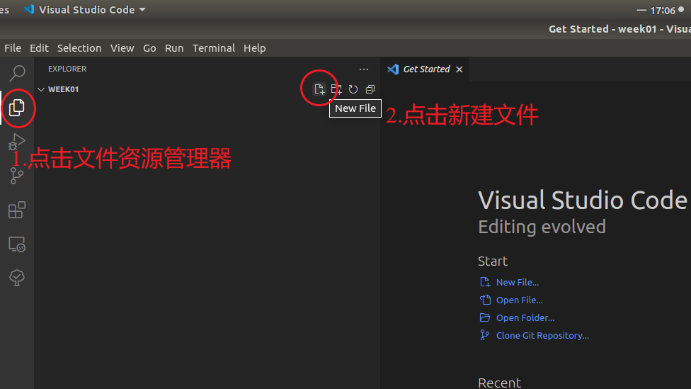  

### 2. 编写代码

```c++
#include<iostream>

int main() {
    std::cout << "Hello World!" << std::endl;
    getchar();
    return 0;
}
```  


### 3. 运行程序

得到运行结果。此处若未更改设置则有可能输出在OUTPUT窗口下,不会影响结果但无法使用键盘交互。  
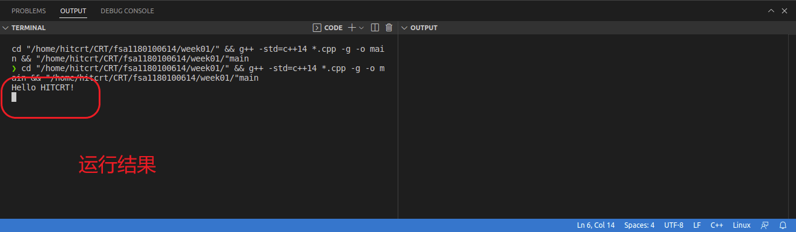

## vscode×git

点击左侧Source Control或快捷键```Ctrl+Shift+G```，打开版本控制界面。如果尚未运行过```git init```指令，可点击Initialize Repository初始化仓库.  
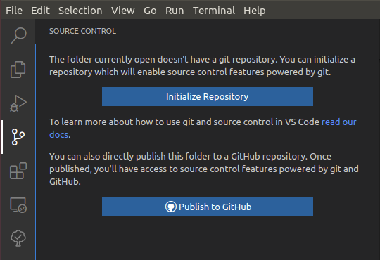
此时点击文件的加号将文件加入到暂存区  
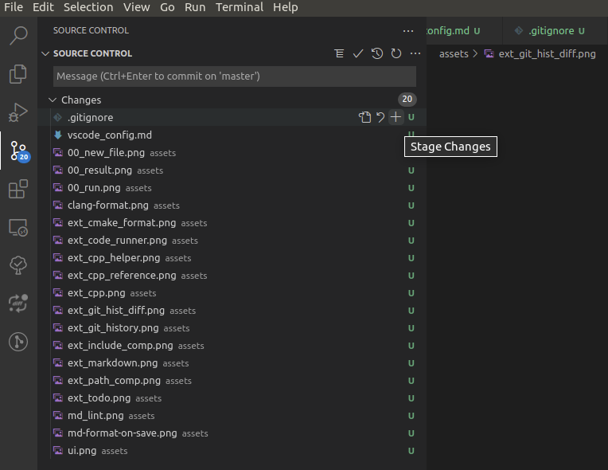  
然后在上方Message框中输入commit的信息,```Ctrl＋Enter```提交  
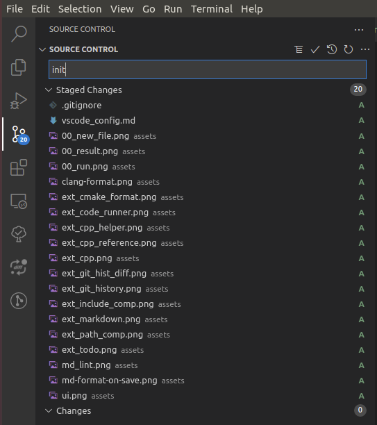
提交后文件后出现Ａ(Added)标志  
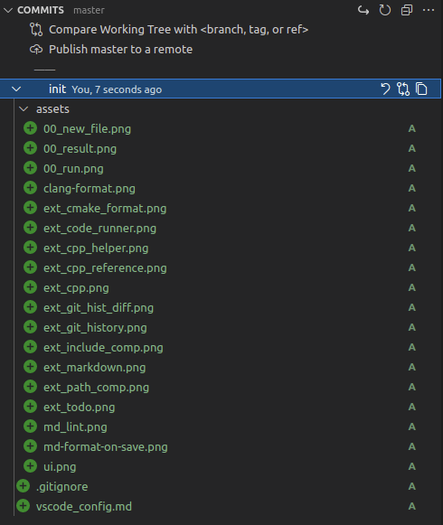  
光标放到SOURCE CONTROL栏后右侧会出现...，点击找到push，即可推送更改到远程
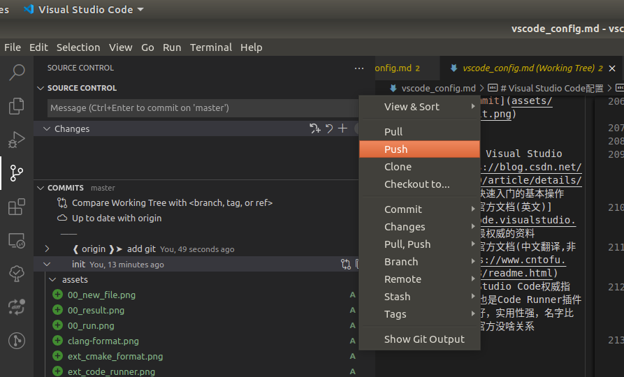
或者本地发生更改时，vscode自动检测到后会提示同步到远程  
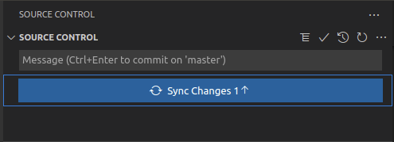

## 扩展阅读

[1][学会用好 Visual Studio Code](https://blog.csdn.net/qq_22338889/article/details/78790964) 快速入门的基本操作  
[2][vscode官方文档(英文)](https://code.visualstudio.com/docs) 最权威的资料  
[3][vscode官方文档(中文翻译,非官方)](https://www.cntofu.com/book/98/readme.html)  
[4]Visual Studio Code权威指南,韩骏.作者也是Code Runner插件的作者，书挺好，实用性强，名字比较误导，书和官方没啥关系
