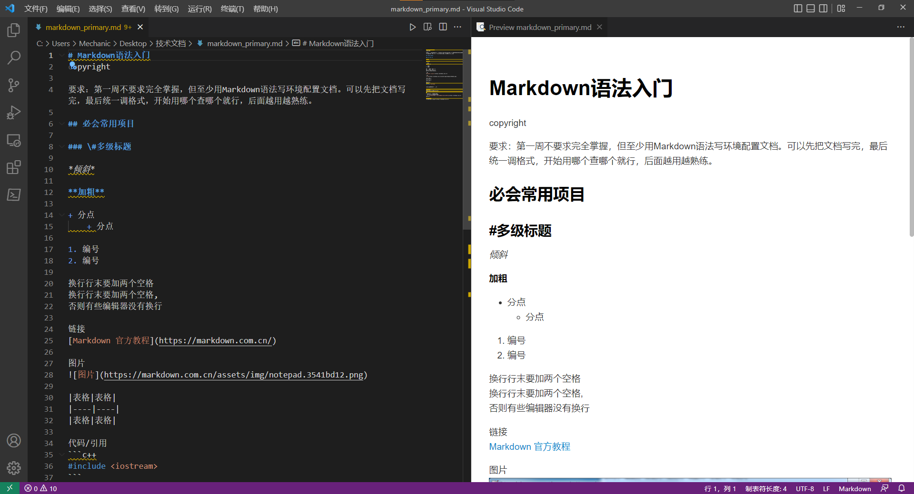
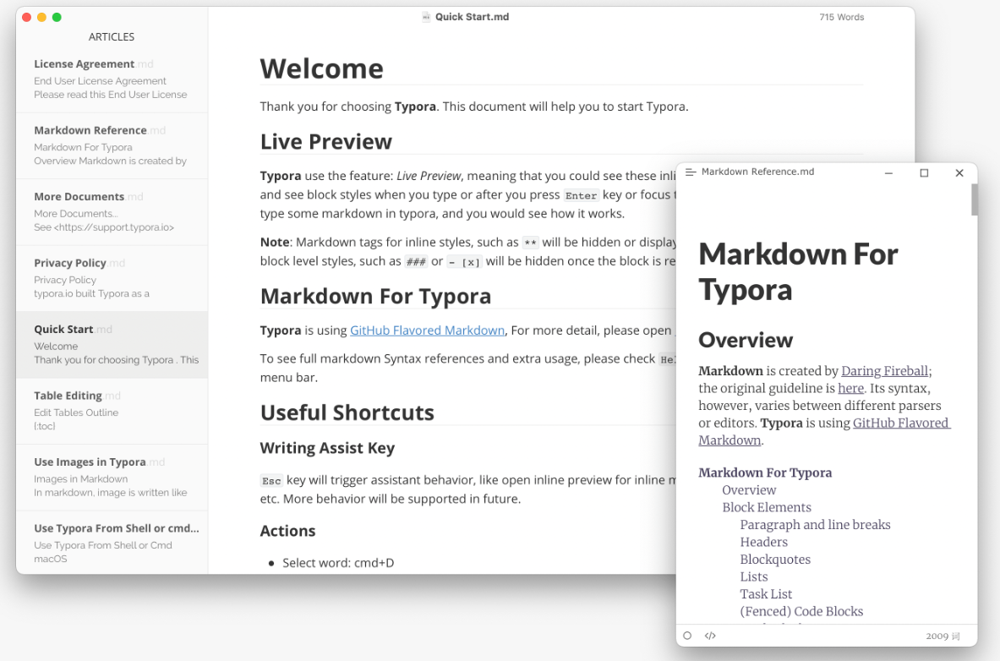
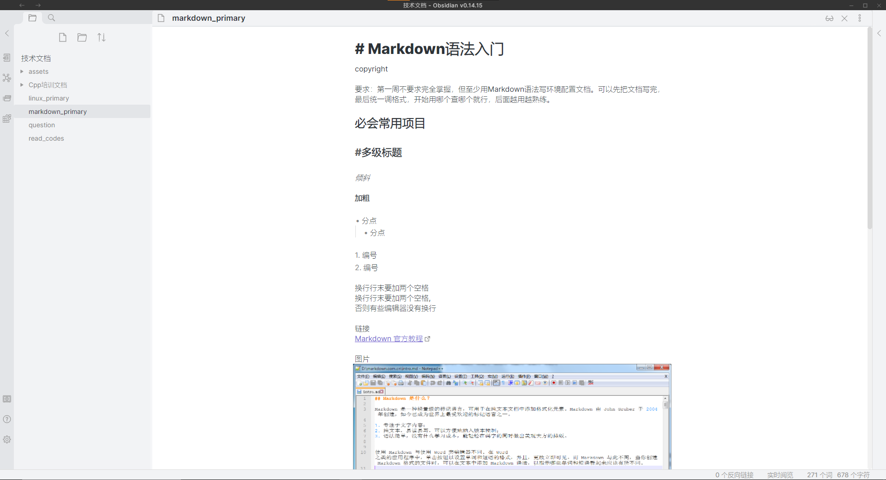

# Markdown语法入门

Copyright (C) 2022, HITCRT_VISION, all rights reserved.  
Author:BG2EDG(928330305@qq.com)  
Time:2022-06-28  

Markdown 是一种轻量级标记语言，它允许人们使用易读易写的纯文本格式编写文档，Markdown文件的后缀名便是“.md”。Github和Gitee上的很多项目都使用Markdown编写README。  
第一周不要求掌握所有Markdown语法，但至少用Markdown语法写环境配置文档。可以先把文档写完，最后统一调格式，开始用哪个查哪个就行，后面越用越熟练。

## 必会常用项目

### \#多级标题

*倾斜*  

**加粗**  

+ 分点  
  + 分点  

1. 编号
2. 编号

&emsp;&emsp;空格缩进  

换行行末要加两个空格  
换行行末要加两个空格,
否则有些编辑器没有换行

链接
[Markdown 官方
教程](https://markdown.com.cn/)

图片


| 表格 | 表格 |
| ---- | ---- |
| 表格 | 表格 |

代码/引用

```c++
#include <iostream>
```

与规定符号冲突时加\转义

## 编辑器

不强制规定，喜欢哪个用哪个

+ vscode安装Markdown All in One以后能够看到右上角有预览按钮，可以编辑并实时预览  

+ Typora，风格清新，付费

+ Obsidian，界面漂亮，免费  

+ [在线markdown编辑器_微信公众号markdown排版工具](https://markdown.com.cn/editor/)

## 扩展阅读

[1][Markdown 官方教程](https://markdown.com.cn/)
